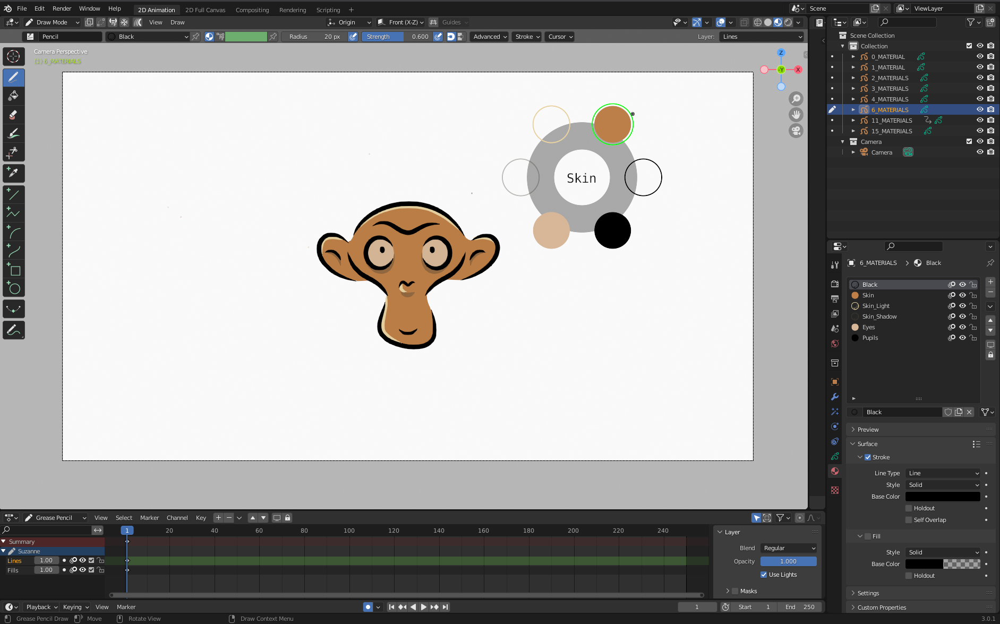

## Grease Pencil Color Picker

Blender add-on to quickly switch between materials of an active Grease pencil object.
Two available modes : 
* *from active* which allows you to switch between the existing materials of the active object,
* *from file* which allows you to use specific material palettes described in a JSON file. In this file, you can specify the layer in which you want each material to be applied, and the tool will switch to that layer.

## Workflow 

* Select a Grease Pencil object,
* Switch to Draw Mode,
* Press S. The list of materials now appear in a wheel-like menu.
* Press Tab to switch current palette (if multiple palettes).
* Left-click on one of the materials to make it active,
* Or right-click (or press ESC) to cancel the operation

## JSON File Specification
At the root of the JSON file, we should find a list of palettes specified by their name, and containing : 

- "materials" \[MANDATORY\] : containing a list of materials and their specification (*). 

- "image" \[OPTIONAL\] : image to be displayed in the center of the tool

    - "path" \[MANDATORY\] : path of the image file

    - "relative" \[OPTIONAL\] : whether the path is relative or absolute (default=True)

(*) Each material contains : 

- "name" of the material (if a material of the same name already exists, it will be updated with the specified parameters)

    - unordered list of material specification fields, all possible fields and default values are written [here](doc/base_material.json)

    - "image" \[OPTIONAL\] : an image to be displayed in the tool when the material is hoverred by the cursor

    - "layer" \[OPTIONAL\] : the name of the layer to switch to when the material is selected (only applies if the root field "image" contains a valid path)

An example of valid JSON file can be found [here](doc/example.json)

## License

Published under GPLv3 license.