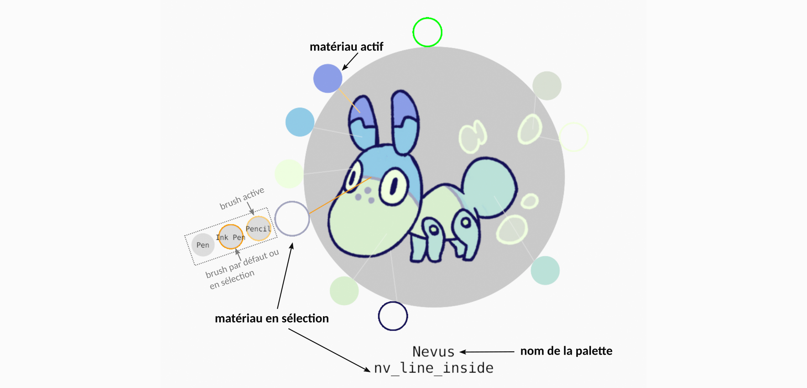

# Grease Pencil Color Picker

Blender add-on to quickly switch between a given set of grease pencil materials.

## Workflow

The file demo_picker.blend contains a ready-to-use example.

### General usage
You need to be in draw mode, with a grease pencil object active to use the picker. In such context, press A anywhere in the view to invoke it.

You can then switch directly to another material of the active palette by left-clicking on it. 

A material in the palette can also be associated to one or more brushes, which appear when you hover the material's preview with the cursor. 
You can select both the material and a brush by clicking on the brush icon.

If you click on the material, no brush will be selected, except if a brush by default was defined for this material, in which case the brush by default will be selected. 
If you press Shift while clicking on the material, then no brush will be selected, even if there is a brush by default affected to the material.

If multiple palettes exists in your file, you can switch between them by pressing Tab while the picker is invoked (switch in reverse order with Shift+Tab). 
You can see the list of the palettes available in your file in the Scene properties panel, under the "Grease Pencil palettes" tab.

In this panel, you can also remove palettes from your blender file, hide some of them, and reload some (or all) of them.

Palettes can be exported and imported as JSON files. 

Note that during the export, all palettes in the current blender file will be exported in one JSON file. Attached images such as palette image, brush custom previews, and material/brush textures will be written in the same directory.

### Editing palettes
In the viewport, press Ctrl+Shift+A to launch the palette editor mode.
Add a palette by clicking on the cross in the gray circle, and entering a name.
You can then : 
* Add, move or remove a material in the palette,
* add or edit a palette image,
* add, move or remove picklines for each material,
* assign brushes for materials. 

## License

Published under GPLv3 license.
