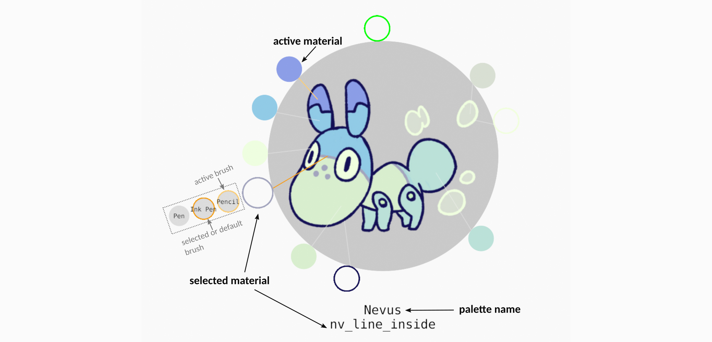

# Grease Pencil Color Picker

Blender add-on to quickly switch between a given set of grease pencil materials.

## Workflow

The file demo_picker.blend contains a ready-to-use example.

### General usage
You need to be in draw mode, with a grease pencil object active to use the picker. In such context, press A anywhere in the view to invoke it.

You can then switch directly to another material of the active palette by left-clicking on it. 

A material in the palette can also be associated to one or more brushes, which appear when you hover the material's preview with the cursor. 
You can select both the material and a brush by clicking on the brush icon.

If you click on the material, no brush will be selected, except if a brush by default was defined for this material, in which case the brush by default will be selected. 
If you press Shift while clicking on the material, then no brush will be selected, even if there is a brush by default affected to the material.

If multiple palettes exists in your file, you can switch between them by pressing Tab while the picker is invoked (switch in reverse order with Shift+Tab). 
You can see the list of the palettes available in your file in the Scene properties panel, under the "Grease Pencil palettes" tab.

In this panel, you can also remove palettes from your blender file, hide some of them, and reload some (or all) of them.

Palettes can be exported and imported as JSON files. 

Note that during the export, all palettes in the current blender file will be exported in one JSON file. Attached images such as palette image, brush custom previews, and material/brush textures will be written in the same directory.

### Editing palettes
In the viewport, press Ctrl+Shift+A to launch the palette editor mode.
Add a palette by clicking on the cross in the gray circle, and entering a name.
You can then : 
* Add, move or remove a material in the palette,
* add or edit a palette image,
* add, move or remove picklines for each material,
* assign brushes for materials.

### Picker FROM PALETTE
* Go to Properties > Scene > Grease Pencil palettes, and click on the *Load File* icon.
* Select the JSON file you want to import, the palettes should appear in the list on the panel
* You can use the buttons in the list to reload or remove a certain palette. You can also click on a palette to make it *active*
* Select a Grease Pencil object, switch to draw mode.
* Press A. The active palette should appear as an icon. 
* You can switch between palettes using Tab (or Shift+Tab to switch in reversed order).
* Select a material : you've added that material to the active GP object and made it the active material.

### Picker FROM ACTIVE 
* Select a Grease Pencil object,
* Switch to Draw Mode,
* Press A. The list of materials now appear in a wheel-like menu.
* Press Tab to switch current palette (if multiple palettes).
* Left-click on one of the materials to make it active,
* Or right-click (or press ESC) to cancel the operation

## JSON File Specification
At the root of the JSON file, we should find a list of palettes specified by their name, and containing : 

- "materials" \[MANDATORY\] : containing a list of materials and their specification (*). 

- "image" \[OPTIONAL\] : image to be displayed in the center of the tool

    - "path" \[MANDATORY\] : path of the image file

    - "relative" \[OPTIONAL\] : whether the path is relative or absolute (default=True)

(*) Each material contains : 

- "name" of the material (if a material of the same name already exists, it will be updated with the specified parameters)

    - unordered list of material specification fields, all possible fields and default values are written [here](doc/base_material.json)

    - "position" \[OPTIONAL\] : angle position of the material in the wheel

    - "image" \[OPTIONAL\] : an image to be displayed in the tool when the material is hoverred by the cursor

    - "layer" \[OPTIONAL\] : the name of the layer to switch to when the material is selected (only applies if the root field "image" contains a valid path)

An example of valid JSON file can be found [here](doc/example.json)

## License

Published under GPLv3 license.
